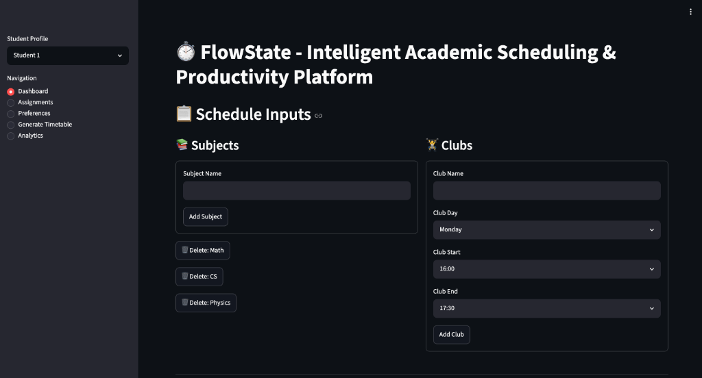
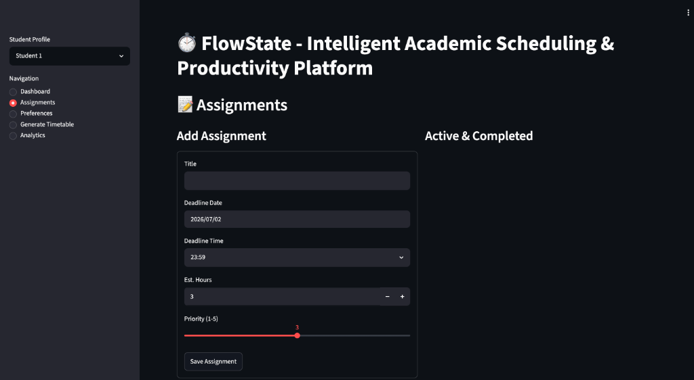
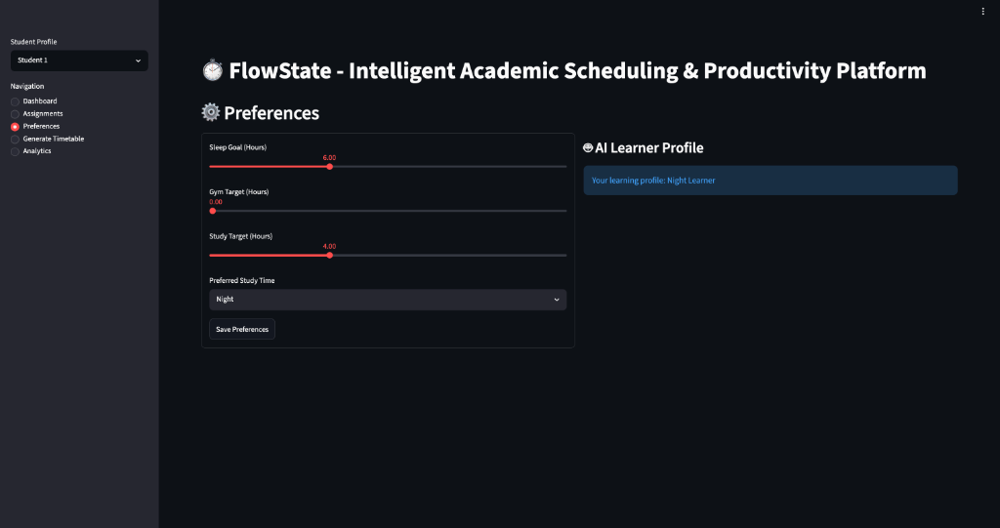
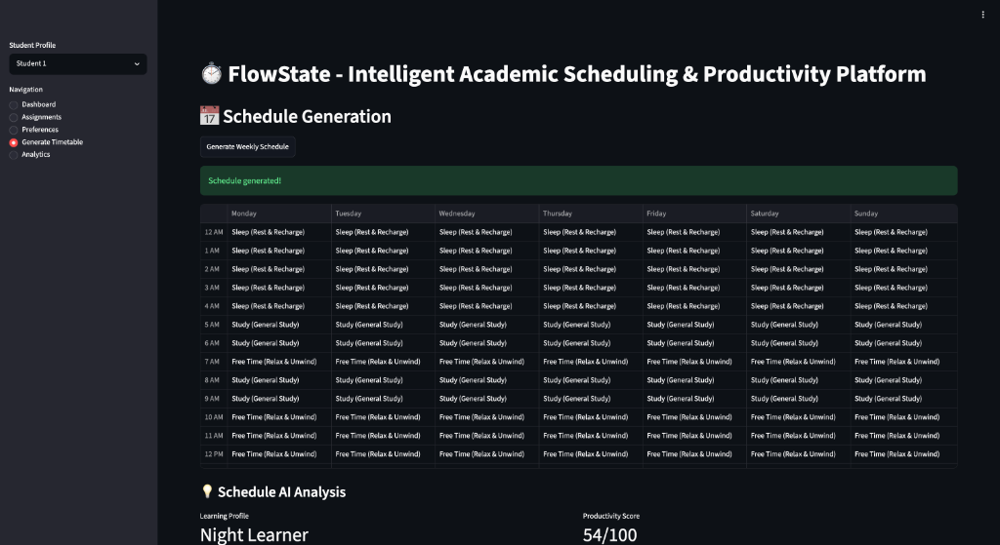
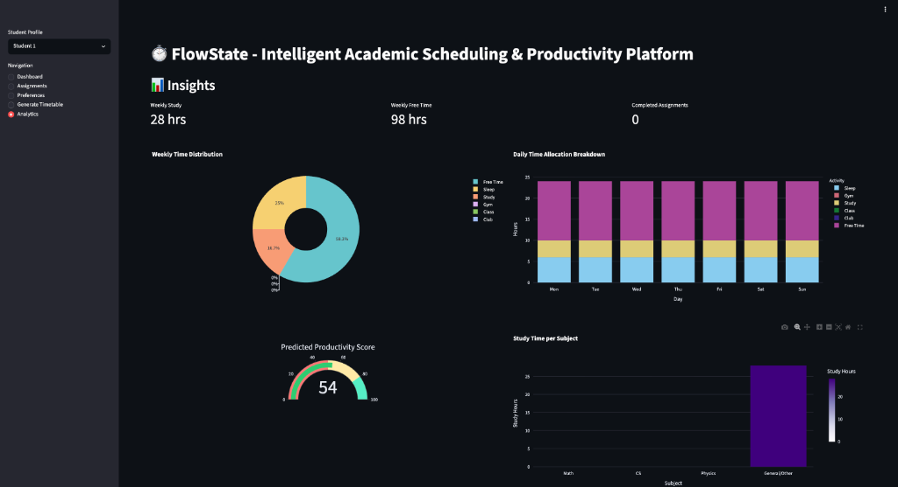

# ⏱️ FlowState - Intelligent Academic Scheduling & Productivity Platform

FlowState is a full-stack academic scheduling and productivity web application designed to help students optimize their weekly routines. By balancing class timetables, club commitments, study targets, sleep goals, and assignment deadlines, FlowState generates conflict-free schedules and provides machine learning-driven study profile insights.

---

## 📸 Application Showcases

### 1. Dashboard (Schedule Inputs)
Configure your core weekly constraints by adding academic subjects, extracurricular clubs, and specific class times.

---

### 2. Assignments Management
Add your course assignments, prioritize them, set estimated completion times, and track them dynamically.

---

### 3. Preferences & AI Learner Profile
Establish daily goals for sleep, exercise, and study targets. Our integrated K-Means clustering algorithm analyzes your scheduling patterns to assign you an AI-driven learning profile.

---

### 4. Schedule Generation
Generate conflict-free weekly timetables automatically with one click. Real-time feedback flags any warnings or scheduling constraint violations.

---

### 5. Analytics & Insights
Monitor your progress through detailed Plotly charts showing time distribution, daily activity breakdowns, estimated study load, and assignment status.

---

## 🛠️ Tech Stack & Architecture
* **Frontend**: Streamlit (Python-based interactive UI)
* **Backend Database**: MySQL (hosted on Railway Cloud)
* **Algorithms & Machine Learning**: Scikit-Learn (K-Means Clustering for student profiles)
* **Data Visualizations**: Plotly (interactive charts & productivity gauge)
* **Hosting/Deployment**: Render Cloud Platform
